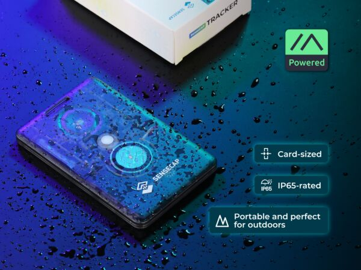
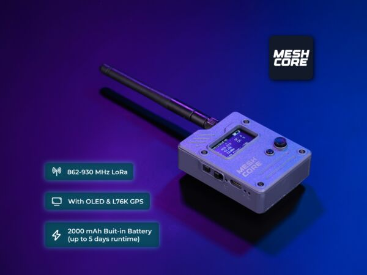
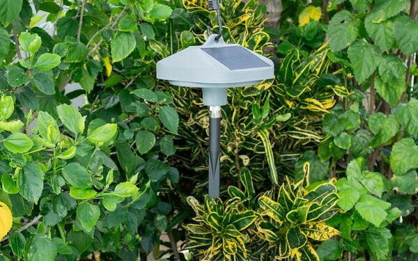
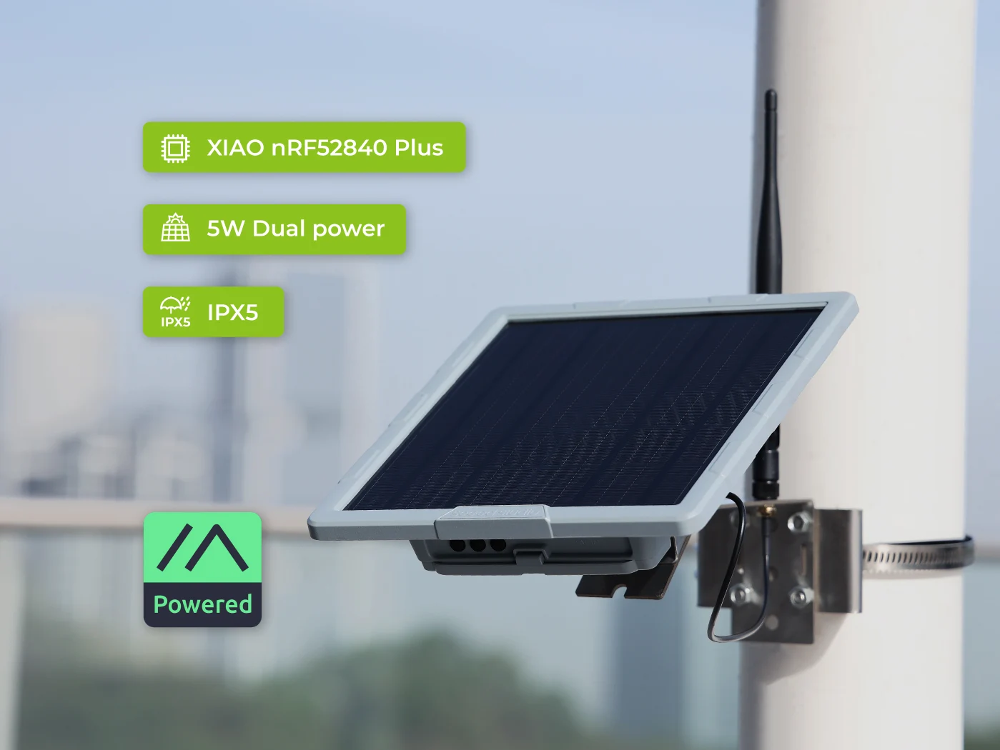
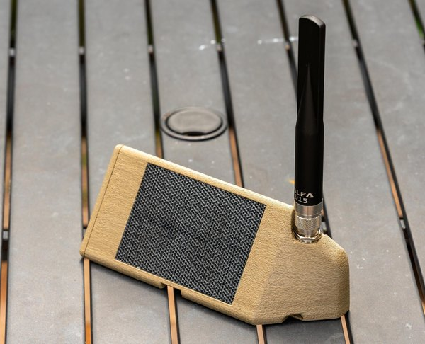

# Buying Guide for Beginners

--8<-- "affiliate.md"

So you've heard about off-grid mesh messaging and want in. This page skips the theory and matches your situation to the fastest path to getting started.

---

## Where do you want to start?

- **[Just get on the network](#just-get-on-the-network)**

    I want to try messaging with the least friction and spend.

- **[Add a repeater node](#add-a-repeater-node)**

    I want to strengthen coverage or extend the network from a fixed location.

- **[Build your own](diy-builds.md)**

    I want to save money or reach a spot a commercial unit can't - custom handhelds, Harbor Breeze tree nodes, or magnetic mount repeaters.

---

## Just Get on the Network

This is the "I want to see if this is for me" path. The trick: **buy two devices**. Having a second lets you test messaging back and forth between two phones right away - you'll get a feel for range, message relay, and network behavior in an afternoon rather than piecing it together gradually as you connect with others on the network.

Buying two of the same device keeps things simple - identical firmware, identical settings. But starting with two different devices is also worth considering: you'll naturally learn more about how form factor, antenna, and battery trade-offs play out in real use. Both approaches work. Pick what makes sense for you:

### Seeed SenseCAP T1000-E - Compact and Pocketable

Credit-card sized and only 6.5mm thick, the T1000-E is the most portable option. IP65 waterproof with built-in GPS, it slips into a pocket and goes anywhere with you.

{ .product-image }

**~$40 each (~$80 for two)** - [specs and where to buy](hardware.md#seeed-sensecap-card-tracker-t1000-e)

### Seeed Wio Tracker L1 Pro - Better Range and Battery Life

The L1 Pro steps up with a larger battery and an external antenna connector - a meaningful range improvement over the T1000-E's internal antenna. The trade-off is a bulkier form factor. If range matters more than pocket size, this is the pick.

{ .product-image }

**~$47 each (~$94 for two)** - [specs and where to buy](hardware.md#seeed-wio-tracker-l1-pro)

!!! tip "Once you have your devices"
    Follow the [Getting Started guide](getting-started.md) - it walks through flashing firmware, installing the app, and connecting to the CSRA network step by step.

---

## Add a Repeater Node

Repeater nodes sit in a fixed location and re-broadcast messages, extending the reach of the network for everyone nearby. A good location - elevated, with clear line of sight - matters more than the hardware you pick.

---

### Buy a Pre-Built Repeater

#### Tree Node

**Best for:** Rural areas, wooded terrain, backyards - hang it high in a tree for above-canopy coverage.

**PeakMesh Altitude** - a solar-powered, weatherproof node designed specifically for tree-hanging deployment. Ships pre-assembled and MeshCore-ready. No flashing, no wiring - hang it and you're done.

{ .product-image }

**~$140**

[Etsy](https://www.etsy.com/listing/4331277320/peakmesh-altitude-tree-hanging-solar){ .md-button .md-button--primary }

---

#### Building / Rooftop Node

**Best for:** Urban and suburban coverage - mounted on a roofline, chimney, or exterior wall for broad neighborhood reach.

**Seeed SenseCAP Solar Node P1-Pro** - purpose-built for permanent outdoor deployment. Ships with MeshCore repeater firmware pre-installed, solar-powered, and includes GPS and an OLED display. The simplest path to a rooftop node.

{ .product-image }

**~$90** - [specs and where to buy](hardware.md#seeed-sensecap-solar-node-p1-pro)

---

#### Magnetic Mount Node

**Best for:** Vehicles, metal rooftops, or any situation where you want quick placement and easy repositioning.

**PeakMesh Magnet Mover** - a low-profile solar node in a weatherproof shell, with four 30 lb magnets in the base that hold it to a vehicle roof or any steel surface. Ships pre-assembled and MeshCore-ready.

{ .product-image }

[Etsy](https://www.etsy.com/listing/1795541518/peakmesh-magnet-mover-solar-meshtastic){ .md-button .md-button--primary }

---

!!! info "What's next"
    - Follow the [Getting Started guide](getting-started.md) to flash firmware, install the app, and connect
    - The [Hardware Guide](hardware.md) covers antennas and enclosures in more detail
    - Interested in building your own repeater? See the [DIY Builds](diy-builds.md) section
