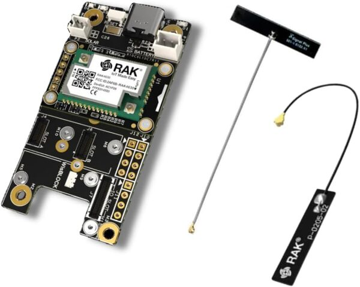
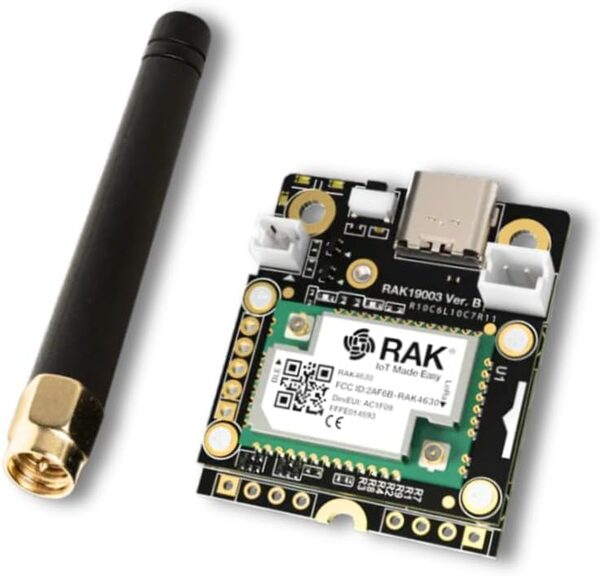
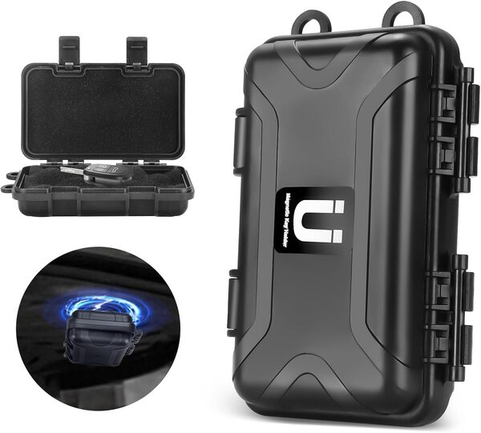
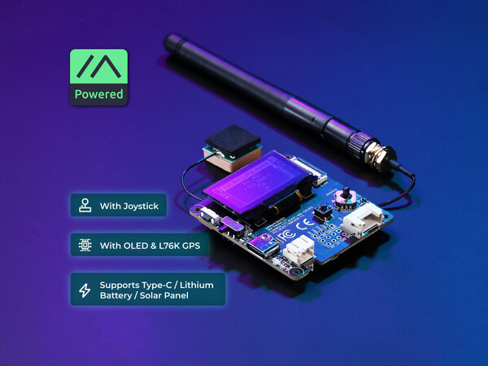
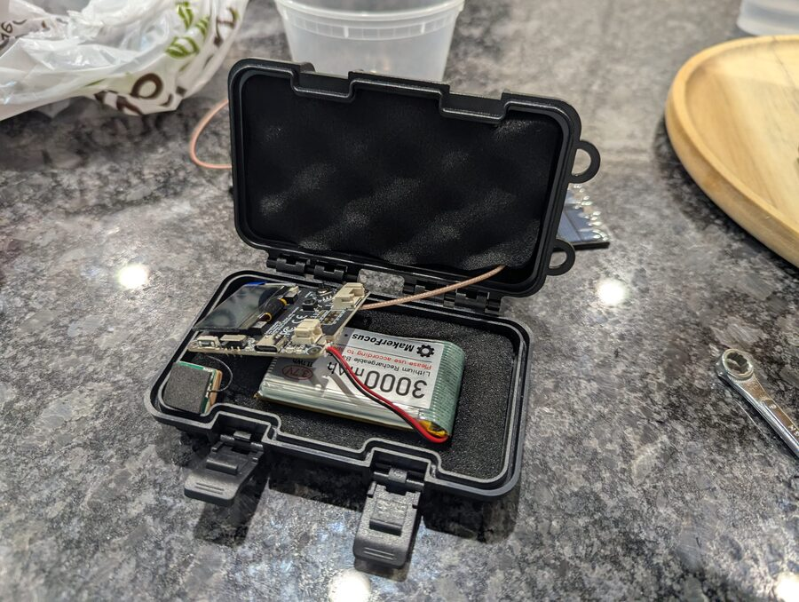
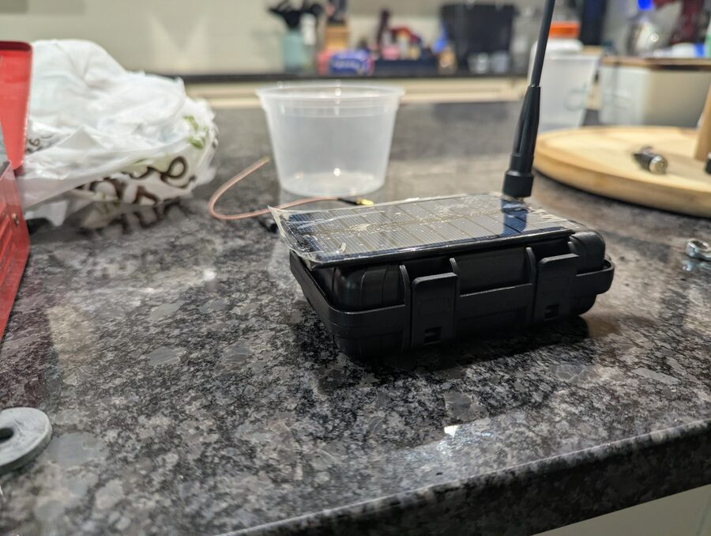
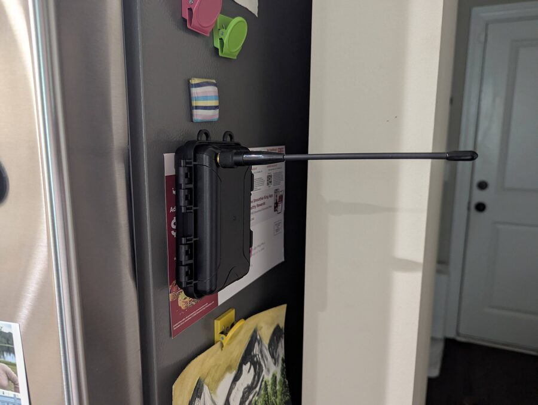

# DIY Builds

So you want to build something. Whether that's saving money, learning how it all fits together, or deploying a node in a spot a commercial unit can't reach — this section has you covered.

!!! info "Affiliate links"
    Amazon links on this page use our affiliate tag. **You pay the same price** — commissions go directly toward hardware for CSRA community relay nodes.

---

## Choose Your Board

All DIY MeshCore nodes — whether a pocket-sized personal radio, a tree-hung solar repeater, or a magnetic vehicle mount — start with one of two base platforms. The board you pick goes into whatever enclosure fits your deployment. Both run the same MeshCore firmware and work on the CSRA network.

### Seeed XIAO + Wio-SX1262

The lowest-cost option at around $13 for the boards alone. The XIAO pairs with the Wio-SX1262 LoRa module and comes in two variants — pick based on your priorities:

**XIAO nRF52840** — extremely low power consumption, significantly extending battery life. The better choice for any battery-powered deployment where the node will run unattended.

**XIAO ESP32-S3 or C6** — adds WiFi connectivity and costs a bit less, but draws more power. A good choice if you need WiFi or are running on wired/solar power and don't mind the trade-off.

No display, battery, or enclosure is included with either variant — you supply those based on your use case.

{ .product-image }

**~$13**

[Amazon](https://www.amazon.com/Wio-SX1262-Meshtastic-862-930MHz-Microcontroller-Integrated/dp/B0G2XV2F72?tag=csrameshcore-20){ .md-button .md-button--primary } &nbsp; [Seeed Studio](https://www.seeedstudio.com/XIAO-nRF52840-Wio-SX1262-Kit-for-Meshtastic-p-6400.html){ .md-button }

### RAK WisBlock

More capable and modular — add GPS, sensors, or a display as your build requires. Two base board variants are common; both run the same firmware and work fine for any MeshCore use case. Get whichever is in stock — availability varies.

**19007** — more sensor expansion slots, slightly larger. The most commonly stocked variant.

{ .product-image }

**19003** — smaller footprint, fewer expansion slots, usually a bit cheaper. Good fit for compact custom enclosures.

{ .product-image }

!!! warning "Buy the Starter Kit — not just the base board"
    RAK sells the base board (19003/19007) and the LoRa radio module (4630/4631) separately, which can be confusing. You need both. The **Starter Kit** bundles them already assembled and is typically the most cost-effective way to get both at once. Don't accidentally order just one or the other.

**$25–60 depending on configuration**

[Amazon](https://www.amazon.com/RAKwireless-WisBlock-Meshtastic-Starter-RAK19007/dp/B0CHKZJK9C?tag=csrameshcore-20){ .md-button .md-button--primary } &nbsp; [Rokland (19007)](https://store.rokland.com/products/rak-wireless-wisblock-meshtastic-starter-kit){ .md-button } &nbsp; [Rokland (19003)](https://store.rokland.com/products/rakwireless-mini-meshtastic-starter-kit-us915-rak19003-4631-sku-115093){ .md-button }

---

## Build Examples

Here are a few builds using the platforms above. Each pairs a board with an off-the-shelf enclosure suited to a particular deployment style.

### Tree Node — Harbor Breeze Solar Light Conversion

A $10 Harbor Breeze outdoor solar security light from Lowe's becomes a solar-powered, weatherproof MeshCore repeater with a RAK WisBlock radio inside. Under $50 total, hangs from a tree branch, and field-proven in the CSRA.

[Full build guide with photos](diy-tree-node.md){ .md-button .md-button--primary }

---

### Magnetic Mount Node

A node in a magnetic mount enclosure sticks firmly to vehicles, metal rooftops, or any steel surface — easy to place and reposition without tools. Works as a personal node or a repeater depending on firmware configuration.

The board inside is up to you. The example build below uses a **Seeed Wio Tracker L1**, but a RAK WisBlock 19003, an XIAO kit, or most other compact boards will fit the same enclosure. Pick whatever you have on hand or can source easily.

{ .product-image }

| Part | |
|---|---|
| Magnetic mount enclosure | [Amazon](https://www.amazon.com/dp/B0DFH5DFB4?tag=csrameshcore-20){ .md-button .md-button--primary } |

---

#### Example board: Seeed Wio Tracker L1

The Wio Tracker L1 is a compact bare board with LoRa and GPS built in — no separate LoRa module needed. Fits neatly in the enclosure alongside a small LiPo battery.

{ .product-image }

**~$20**

[Seeed Studio](https://www.seeedstudio.com/Wio-Tracker-L1-p-6453.html){ .md-button .md-button--primary }

Flash MeshCore firmware using the [Installation guide](installation.md), then set the device role as needed in the MeshCore app settings.

---

#### Build photos

Wio Tracker L1 and 3000mAh LiPo battery seated in the foam-lined enclosure, with a copper SMA pigtail routed to the connector.

Enclosure closed with a small solar panel bonded to the lid and antenna attached.

Finished node deployed on a metal surface — the magnetic base holds firm with no fasteners needed.

---

!!! info "Next steps for any build"
    - [Installation guide](installation.md) — flash MeshCore firmware onto your board
    - [Hardware Guide](hardware.md) — antennas, enclosures, and power options
    - [Getting Started guide](getting-started.md) — pair to the app and join the CSRA network
