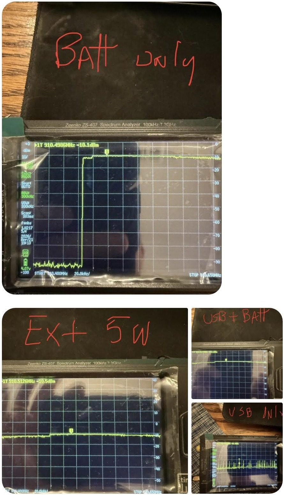

# RAK 1W LoRa Booster Build

The RAK3401 is a 1-watt LoRa booster kit designed for MeshCore and Meshtastic nodes. It pairs with a standard RAK WisBlock base board and adds a dedicated PA stage that pushes output to the legal limit — a meaningful jump over the ~100mW you get from a stock WisBlock radio module.

## The Board

The RAK3401 kit consists of a 1W PA module that mounts on top of a compatible RAK WisBlock base board. It replaces the standard LoRa module slot and handles the RF amplification internally, so no external amplifier or additional wiring is required.

**~$35–45**

[RAK Store](https://store.rakwireless.com/products/meshtastic-1w-lora-booster-kit-rak3401){ .md-button .md-button--primary }

---

## Powering the 1W Board

The higher output power means higher current draw compared to a stock WisBlock — so how you power the board matters. The tested configurations are:

| Mode | Description |
|---|---|
| Battery only | LiPo battery connected to the RAK battery input — useful for testing, not a typical deployment |
| USB only | Powered via USB-C, no battery |
| USB + Battery | Both connected simultaneously — a common real-world setup |
| External 5V | External regulated 5V supply via the WisBlock 5V input |

The PA's current demand during transmit is the key variable — the power source needs to be able to supply it fast enough to sustain full output.

### USB-only is the exception

Testing conducted by **ThatGuy** in the MeshCore Discord showed that USB alone is the one mode that falls short. An external 5V supply and USB combined with a battery both produce equivalent full output. The battery-only test — while not a typical deployment — confirms it's the battery that makes the difference: USB power by itself cannot source current quickly enough to maintain the PA at full power during transmit.

{ .constrained-image }

The measurements were taken through a 40 dB attenuator. The top capture is **Batt Only** reading **-10.1 dBm** at the analyzer — correcting for the attenuator puts true output right at **30 dBm (1W)**. The bottom row shows External 5V, USB + Battery, and USB Only — the first two match the battery-only result, while USB alone trails behind.

!!! success "Key takeaway"
    Battery alone, external 5V, and USB + battery all achieve full 1W output. **USB alone does not** — it can't source current fast enough to sustain the PA at full power. For any deployment where you're plugging in via USB without a battery, expect reduced output.

    This also means a standard RAK WisBlock solar + battery setup is fully suitable for a 1W deployment. The solar panel charges the battery through the WisBlock's solar input; the battery is what actually drives the PA, so full output is maintained regardless of whether the panel is actively charging.

---

## Deployment Notes

- Use a **quality LiPo with adequate C-rating** — the PA draws significantly more current during transmit than a stock radio. A cheap or undersized battery may sag under load.
- A **solar charging setup** works well with this board. The RAK WisBlock solar input handles the charging; the battery buffers transmit current spikes the same as any other deployment.
- The higher output power increases heat. Avoid sealing the board in a completely unvented enclosure without accounting for thermal management on long-running repeater nodes.
- Antenna quality matters more at higher power. A poor antenna or bad SMA connection wastes the extra power as heat in the connector.

---

!!! info "Next steps"
    - [Installation guide](installation.md) — flash MeshCore firmware onto your board
    - [DIY Builds overview](diy-builds.md) — enclosures and build examples
    - [Hardware Guide](hardware.md) — antennas and power options
