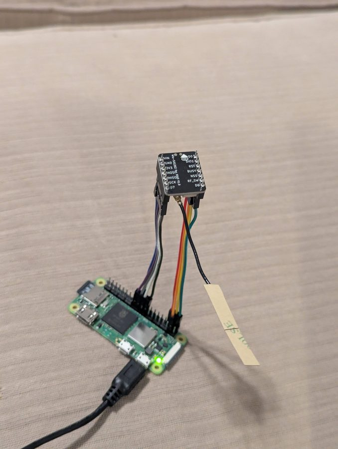
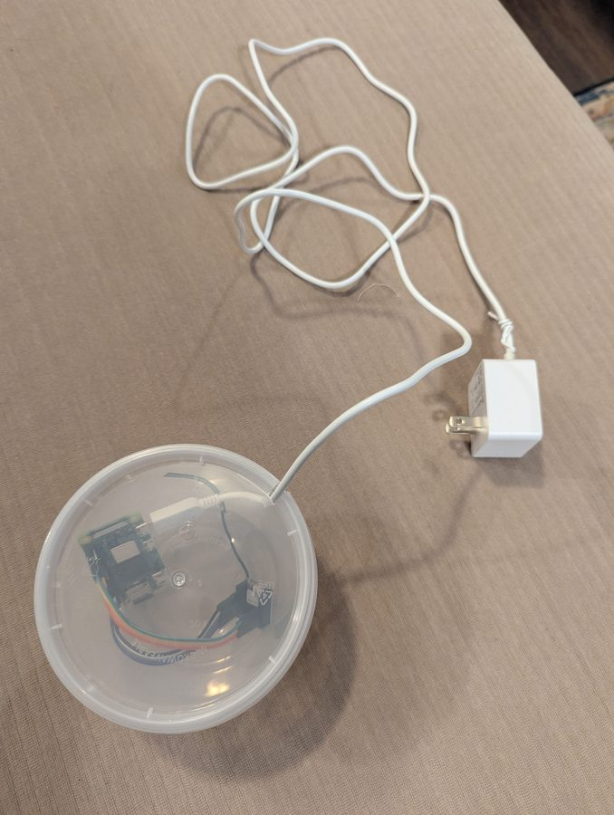

# Observer Node: Raspberry Pi + Wio SX1262

A cheap Raspberry Pi paired with a Wio SX1262 LoRa module makes a capable MeshCore observer you can leave plugged in anywhere there's power and WiFi. Once deployed, it requires no hands-on access - you manage it remotely over SSH.

--8<-- "affiliate.md"

---

## What It Does

This build is aimed at locations where you want a persistent, low-maintenance presence on the mesh without leaving an expensive node unattended. A few good uses:

- Feed MQTT observer networks like [letsmesh.net](https://analyzer.letsmesh.net/) and [Corescope](https://corescope.csramsh.org) with live mesh data
- Host [meshcore-bot](https://github.com/agessaman/meshcore-bot) for automated mesh testing
- Provide a remote WiFi companion endpoint for testing new configs
- Stay accessible over SSH via WireGuard even after deployment

---

## Parts List

Prices as of Feb 2026.

| Part | Price | |
|---|---|---|
| Raspberry Pi Zero 2W | ~$18 | [Amazon](https://www.amazon.com/dp/B09LH5SBPS?tag=csrameshcore-20){ .md-button .md-button--primary } &nbsp; [Digikey](https://www.digikey.com/en/products/detail/raspberry-pi/SC0721/24627135){ .md-button } |
| Wio SX1262 Dev Board | ~$5 | [Seeed Studio](https://www.seeedstudio.com/Wio-SX1262-for-XIAO-p-6379.html){ .md-button .md-button--primary } |
| 64GB microSD card | ~$12 | [Amazon](https://www.amazon.com/s?k=64gb+microsd+class+10+a1&tag=csrameshcore-20){ .md-button .md-button--primary } |
| 5V 2.5A microUSB power supply | ~$8 | [Amazon](https://www.amazon.com/s?k=5v+2.5a+micro+usb+power+supply+raspberry+pi&tag=csrameshcore-20){ .md-button .md-button--primary } |
| Female-to-female jumper wires | ~$2 | [Amazon](https://www.amazon.com/dp/B0F8VDMHRT?tag=csrameshcore-20){ .md-button .md-button--primary } |

**Total: ~$45**

!!! tip "Any Pi works"
    The Zero 2W is the lowest-cost option and plenty capable for this use case. Any larger Pi (3, 4, 5) will work fine - the wiring and software setup is identical. A bigger Pi may already be sitting in a drawer.

!!! warning "Pi prices are volatile right now (July 2026)"
    As of July 2026, Raspberry Pi supply issues have pushed street prices well above MSRP - the Zero 2W in particular is often scalped far past its ~$18 list price or simply out of stock. A Pi may no longer be the cheapest path. Some options:

    - **Check stock, not just price.** Use [rpilocator.com](https://rpilocator.com) to find authorized resellers selling at or near MSRP before paying a scalper premium.
    - **Use a Pi you already own.** Any 3/4/5 in a drawer works with identical wiring and setup, so buying nothing beats any price.
    - **Consider a Pi alternative.** Similar single-board computers (Radxa Zero, Orange Pi Zero, Libre Le Potato, etc.) can run the same software. Wiring pin numbers and GPIO setup will differ from the table below, so you'll need to map pins for your board.
    - **Wait it out.** If the build isn't urgent, prices tend to normalize once supply recovers - watch rpilocator and buy when a board hits list price.

!!! tip "Get the version with header pins"
    The Pi Zero 2W is sold with and without GPIO header pins soldered. Get the version with headers pre-soldered - it saves a soldering step and makes attaching jumper wires straightforward.

You'll also want a small plastic enclosure - since this is an indoor build with no weatherproofing requirements, a basic project box works fine.

---

## Wiring the Pi and SX1262

The SX1262 connects to the Pi's SPI bus plus a few GPIO pins for control signals. The table below uses the Wio SX1262 pin numbering where R1 is the top-right pin and L1 is the top-left.

| SX1262 Pin | Function | Pi Pin | BCM GPIO |
|---|---|---|---|
| R2 GND | Ground | Pin 20 | - |
| R3 3V3 | 3.3V Power | Pin 17 | - |
| R4 MOSI | SPI MOSI | Pin 19 | GPIO10 |
| R5 MISO | SPI MISO | Pin 21 | GPIO9 |
| R6 SCK | SPI Clock | Pin 23 | GPIO11 |
| L2 DIO1 | IRQ | Pin 36 | GPIO16 |
| L3 NRST | Reset | Pin 37 | GPIO26 |
| L4 BUSY | Busy | Pin 38 | GPIO20 |
| L5 NSS | SPI CE0 | Pin 40 | GPIO21 |

!!! tip "Pin references"
    A pinout diagram for the Pi Zero 2W is available at [pinout.xyz](https://pinout.xyz). The SX1262 board's silkscreen labels match the table above.



---

## Setting Up the SD Card

Use [Raspberry Pi Imager](https://www.raspberrypi.com/software/) to flash the card. Under OS, choose **Raspberry Pi OS (other)** - **Raspberry Pi OS Lite (64-bit)**.

In the imager's customization settings before writing:

- Enter your WiFi credentials
- Set a hostname
- Add your SSH public key for access

---

## Configuring the Pi

Pop the SD card in, power up, and find the Pi's IP on your network. SSH in, then run:

```bash
sudo raspi-config
```

Navigate to **Interface Options** - **SPI** - **Yes** to enable SPI for the SX1262.

Then install packages:

```bash
sudo apt update && sudo apt install -y vim procps jq rpi-usb-gadget openresolv wireguard docker.io docker-compose
```

Enable USB gadget mode (lets you SSH over a direct USB cable if you need to reconfigure a deployed unit without network access):

```bash
sudo rpi-usb-gadget on
```

Add the pi user to the docker group, then reboot to apply SPI, gadget, and group changes:

```bash
sudo usermod -aG docker pi
sudo shutdown -r now
```

---

## Software

### WireGuard

If you already run a WireGuard server, generate a new client config and copy it to the Pi at `/etc/wireguard/wg.conf`. Tweak `[Peer] AllowedIPs` to limit the tunnel to only your VPN subnet (e.g. `10.8.0.0/24`) - there's no reason this device needs a route to the wider internet through the tunnel.

```bash
sudo systemctl enable wg-quick@wg
sudo systemctl start wg-quick@wg
```

Verify connectivity using the WireGuard IP rather than the local IP once it's up.

!!! warning "Untrusted device consideration"
    These units may be in locations you don't fully control. Consider treating them as untrusted clients on your VPN - restricting them so they can only respond to inbound connections rather than initiate new ones. On a wg-easy setup, you can do this with iptables rules in `WG_POST_UP`/`WG_POST_DOWN`:

    ```
    WG_POST_UP=iptables -I FORWARD -i wg0 -s 10.8.0.9 -m conntrack --ctstate NEW -j DROP; iptables -I INPUT -i wg0 -s 10.8.0.9 -m conntrack --ctstate NEW -j DROP
    WG_POST_DOWN=iptables -D FORWARD -i wg0 -s 10.8.0.9 -m conntrack --ctstate NEW -j DROP; iptables -D INPUT -i wg0 -s 10.8.0.9 -m conntrack --ctstate NEW -j DROP
    ```

    Replace `10.8.0.9` with the actual IP allocated to your device. These rules need to be updated for each new unit.

---

### Captive Portal Handling (optional)

Some locations use a captive portal that requires a browser-style login before granting internet access. The script below handles one particular portal type - you'll likely need to customize it for your location. Skip this section if your deploy site has open WiFi.

The script is written to run every minute from cron but throttles itself: it checks every minute for the first 10 minutes after boot, then backs off to every 10 minutes.

`/home/pi/connect.py`

```python
#!/usr/bin/env python3

"""
Check for a captive portal and log in to gain internet connectivity.
Runs from cron every minute but throttles after first 10 minutes of uptime.
"""

import requests
import re
import sys
import time

def get_uptime_seconds():
    with open('/proc/uptime', 'r') as f:
        return float(f.readline().split()[0])

try:
    with open('last_connect_run.txt', 'r') as f:
        last_run = float(f.readline().strip())
        time_since_last_run = time.time() - last_run
except:
    time_since_last_run = 99999999

if get_uptime_seconds() > 60 * 10:
    if time_since_last_run < 60 * 10:
        print(f'only {time_since_last_run:.0f} seconds since last run...waiting...')
        sys.exit(0)

with open('last_connect_run.txt', 'wt') as f:
    f.write(str(time.time()))

session = requests.Session()
headers = {"User-Agent": "Mozilla/5.0 Chrome/145 Safari/537.36"}
test_url = "http://google.com"

print("STEP 1: trigger captive portal")
r = session.get(test_url, headers=headers, allow_redirects=False)
login_url = re.search(r"LoginURL>(.*?)</LoginURL>", r.text)
if not login_url:
    print("no captive portal found - done!")
    sys.exit(0)
login_url = login_url.group(1)
print("Login URL:", login_url)

print("STEP 2: load splash page")
r2 = session.get(login_url, headers=headers)

print("STEP 3: call grant")
grant_url = re.sub(r"\?.*", "", login_url) + "grant?continue_url=http://google.com"
r3 = session.get(grant_url, headers={**headers, "Referer": login_url})
print("Grant status:", r3.status_code)
```

Make it executable:

```bash
chmod +x /home/pi/connect.py
```

Add to the pi's crontab (`sudo crontab -e`):

```
* * * * * ping -c 1 -W 2 10.8.0.1
* * * * * /home/pi/connect.py
```

!!! note
    The ping line keeps the WireGuard tunnel alive by generating outbound traffic. This is a workaround for a firewall config issue and may not be needed in your setup.

---

### openHop Repeater

[openHop Repeater](https://github.com/openhop-dev/openhop_repeater) (formerly pyMC_Repeater) is the core software - it handles communication with the SX1262 over SPI and provides a companion TCP interface that meshcore-bot and other tools can connect to.

```bash
git clone https://github.com/openhop-dev/openhop_repeater.git
cd openhop_repeater
cp config.yaml.example config.yaml
```

Edit `config.yaml`. The SX1262 section should match your wiring from the table above:

```yaml
sx1262:
  bus_id: 0
  busy_pin: 20
  cs_id: 0
  cs_pin: 21
  dio3_tcxo_voltage: 1.8
  irq_pin: 16
  is_waveshare: true
  reset_pin: 26
  rxen_pin: 12
  rxled_pin: -1
  txen_pin: 13
  txled_pin: -1
  use_dio2_rf: false
  use_dio3_tcxo: true
```

Update `docker-compose.yml` to expose the SPI and GPIO devices:

```yaml
services:
  openhop-repeater:
    build: .
    container_name: openhop-repeater
    restart: unless-stopped
    ports:
      - 8000:8000
      - 5000:5000
      - 5001:5001
    devices:
      - /dev/spidev0.0
      - /dev/spidev0.1
      - /dev/gpiochip0
      - /dev/gpiochip4
      - /dev/gpiomem
    cap_add:
      - SYS_RAWIO
    group_add:
      - plugdev
    volumes:
      - ./config.yaml:/etc/openhop_repeater/config.yaml
      - ./data:/var/lib/openhop_repeater
```

Start it:

```bash
docker-compose up -d
docker-compose logs -f
```

---

### meshcore-bot

[meshcore-bot](https://github.com/agessaman/meshcore-bot) connects to the companion interface exposed by openHop Repeater and provides automated mesh testing and bot functionality.

```bash
cd ~
git clone https://github.com/agessaman/meshcore-bot.git
cd meshcore-bot
mkdir -p data/{backups,config,databases,logs}
cp config.ini.minimal-example data/config/config.ini
ln -s data/config/config.ini .
```

Edit `config.ini`:

```ini
[Connection]
connection_type = tcp
hostname = 127.0.0.1
tcp_port = 5000

[Bot]
bot_name = YourNode-bot
advert_interval_hours = 1
startup_advert = zero-hop
```

In `docker-compose.yml`, uncomment the `network_mode: host` block and remove the `:ro` suffix on the config volume mount. Then start it the same way as openHop Repeater.

---

## Preparing for Deployment

Before taking the unit to its final location, add the destination's WiFi credentials:

```bash
sudo nmtui
```

Set the new network to auto-connect. If you're deploying to multiple locations, add all of them - the Pi will connect to whichever is available.

Also confirm that the WireGuard `[Peer] Endpoint` address is reachable from the deploy location's network, not just your home network.

---

## Result



Plug the unit in, walk away, and SSH in via WireGuard whenever you need to make changes. The openHop Repeater and bot services restart automatically on reboot, and the captive portal script (if needed) handles reconnection after power cycles.

!!! note "This is one example deployment"
    The steps above reflect a specific setup - particular software choices, a WireGuard server already in place, and deploy locations with a known captive portal. Your situation will likely differ. Treat this as a starting point: some sections (WireGuard, captive portal handling, meshcore-bot) may not apply to you at all, and others may need adjustment for your network environment, hosting preferences, or intended use.
