# DIY Tree Node Build: Harbor Breeze Solar Light Conversion

This guide walks through converting a Harbor Breeze outdoor solar security light into a solar-powered MeshCore repeater node. The light's enclosure, built-in solar panel, and AA battery holder do all the heavy lifting - you add a RAK WisBlock radio and a few pigtails, and you have a weatherproof, solar-powered node for under $50 total.

--8<-- "affiliate.md"

---

## Parts List

| Part | Price | |
|---|---|---|
| Harbor Breeze 1-Watt Solar Security Light (black) | ~$10 | [Lowe's](https://www.lowes.com/pd/Harbor-Breeze-1-Watt-Black/5015598033){ .md-button .md-button--primary } |
| RAK WisBlock 19007 Starter Kit | ~$35 | [Amazon](https://www.amazon.com/RAKwireless-WisBlock-Meshtastic-Starter-RAK19007/dp/B0CHKZJK9C?tag=csrameshcore-20){ .md-button .md-button--primary } &nbsp; [Rokland](https://store.rokland.com/products/rak-wireless-wisblock-meshtastic-starter-kit){ .md-button } |
| 915 MHz SMA antenna (recommended) | ~$8 | [Amazon](https://www.amazon.com/dp/B0DPSB5F8R?tag=csrameshcore-20){ .md-button .md-button--primary } |
| SMA pigtail, ~8" / 20cm | ~$8 | [Amazon](https://www.amazon.com/dp/B0B9RXM7TB?tag=csrameshcore-20){ .md-button .md-button--primary } |
| ZH 1.5mm power pigtail (solar input) | ~$7 | [Amazon](https://www.amazon.com/dp/B0CRQZLGFZ?tag=csrameshcore-20){ .md-button .md-button--primary } |
| PH 2.0mm power pigtail (battery input) | ~$7 | [Amazon](https://www.amazon.com/dp/B0B2DC8ST8?tag=csrameshcore-20){ .md-button .md-button--primary } |
| 4mm paracord (camo recommended) | ~$5 | Any hardware store |

!!! tip "19003 also works"
    The smaller RAK WisBlock 19003 mini base board also fits this enclosure. See [Choose Your Board](diy-builds.md#rak-wisblock) for how the 19003 and 19007 compare.

!!! tip "Antenna choice for tree nodes"
    Use the recommended whip (standard SMA) - it makes better horizontal links to nearby nodes than a high-gain outdoor antenna. See the [Antennas section](hardware.md#antennas) for why, and for the SMA vs RP-SMA details.

**Tools needed:** Soldering iron, heat shrink tubing, drill with small bit (sized for your SMA connector), black marine RTV sealant, wire strippers.

---

## Build Steps

### Step 1 - Start with the Harbor Breeze light

Pick up one (or more) Harbor Breeze 1-Watt black solar security lights from Lowe's. The enclosure, solar panel, and AA battery holder are exactly what you need - you're just replacing the light PCB with a RAK radio.

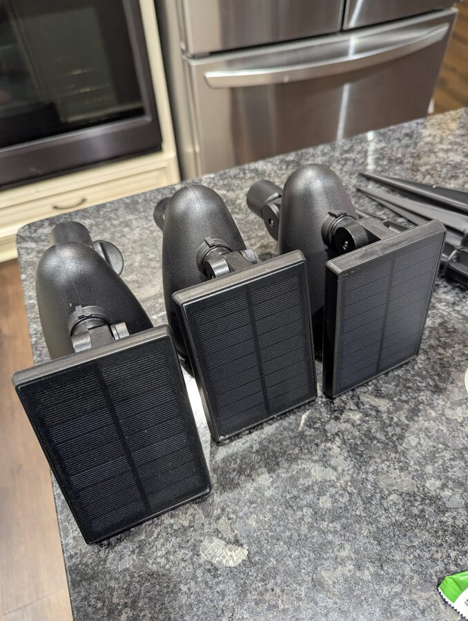

---

### Step 2 - Open the enclosure and remove the LED assembly

Unscrew the solar panel lid to expose the battery compartment and switch board. The black wire running to the LED light in the head can be snipped for easy removal - no need to desolder it. Remove the AA battery. Desolder the remaining wires from the switch board so you can work on it separately.

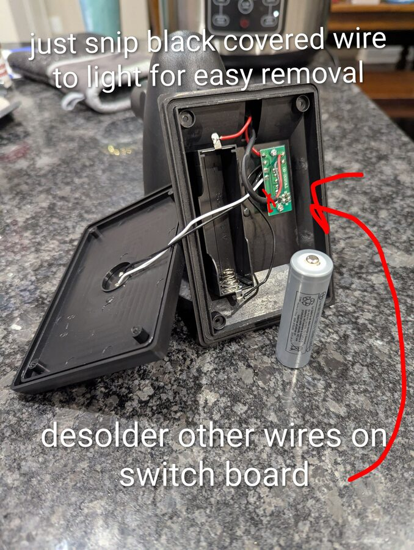

---

### Step 3 - Strip the switch board down to just the switch

The switch board (TW1832-80) has a light-control IC you don't need. Remove it so only the slide switch remains. This leaves you with a clean on/off switch for the RAK board with the B+ and B- pads exposed.

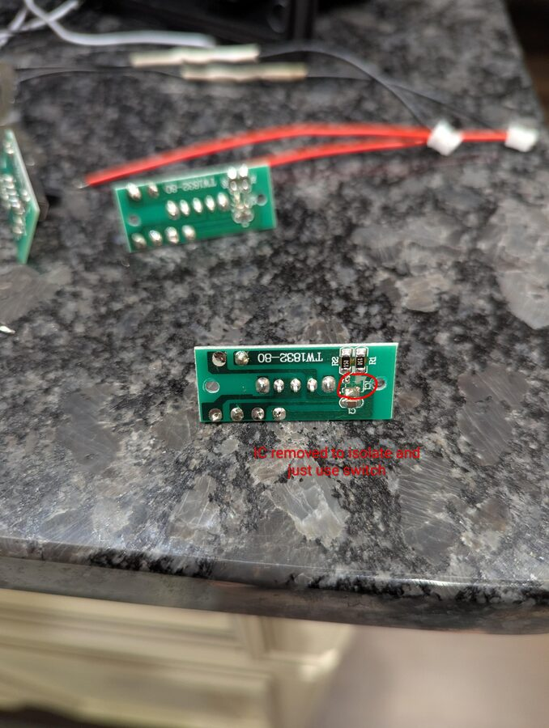

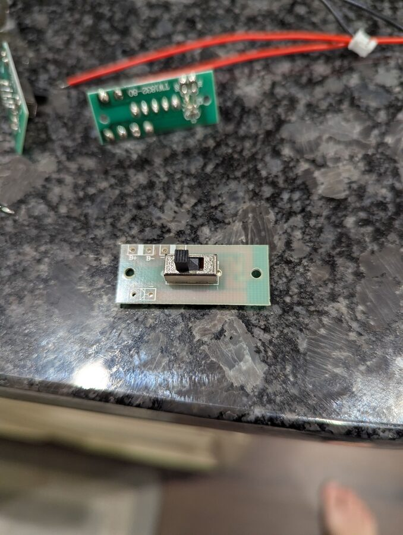

---

### Step 4 - Re-wire the solar panel with a ZH 1.5mm pigtail

The solar panel's original leads need to be replaced with a ZH 1.5mm connector to match the RAK board's solar input. Desolder the existing wires from the back of the solar panel and solder on your ZH 1.5mm pigtail. The polarity marker (+) is faintly embossed on the plastic - make sure red goes to +.

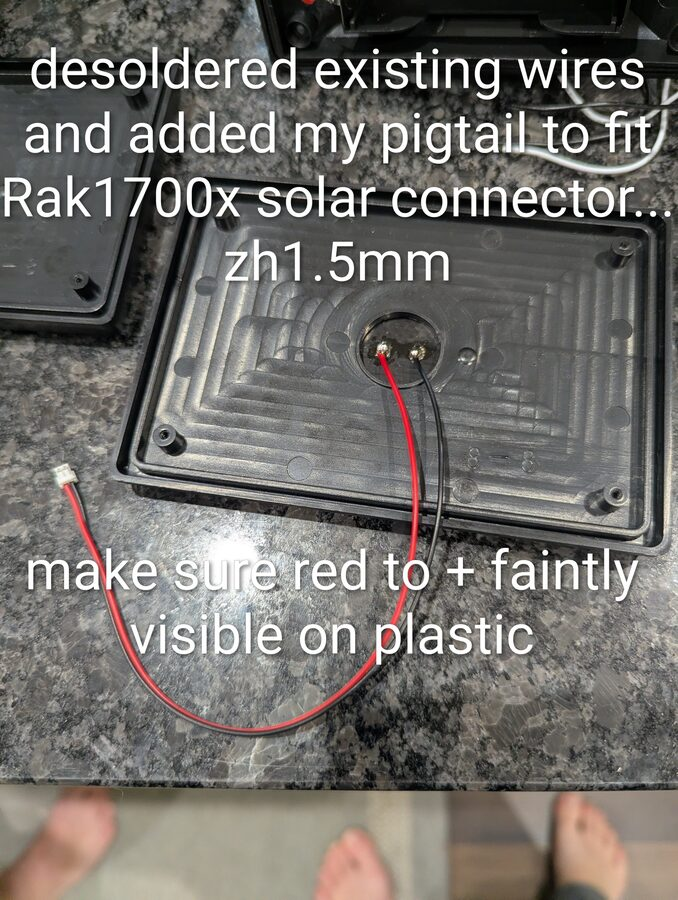

---

### Step 5 - Wire the battery compartment with a PH 2.0mm pigtail

The battery holder's leads need to be extended and terminated with a PH 2.0mm connector for the RAK board's battery input. Pull the negative battery spring out of its holder - it gives you more room to work and makes the join easier. Splice the pigtail in and shrinkwrap the joint.

!!! warning "Check polarity"
    The PH 2.0mm connector pinout can vary. Verify polarity against the RAK board before plugging in - you can swap the pins in the connector housing if needed.

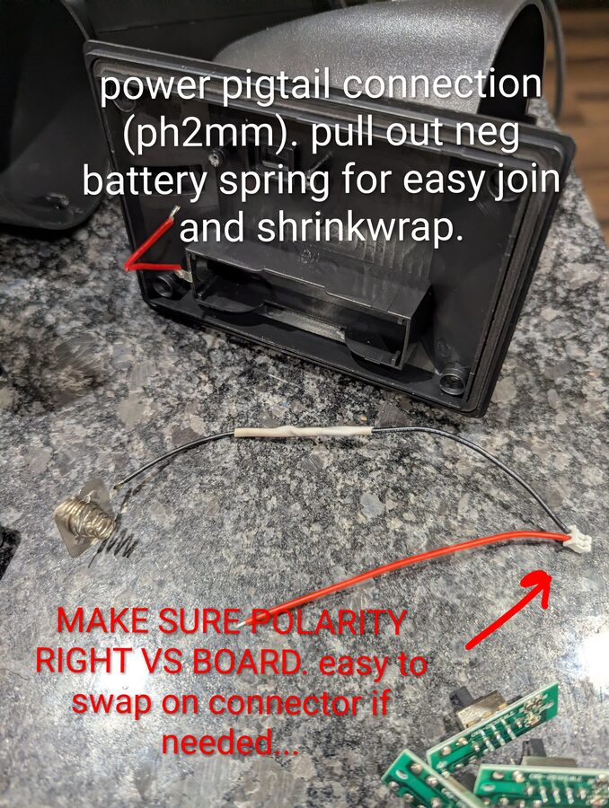

---

### Step 6 - Splice the wires

For a reliable joint without soldering mid-wire: strip the end of each wire, then strip a bit further back and slide the outer sheath down. Twist the bare sections together in the middle, then cover with heat shrink.

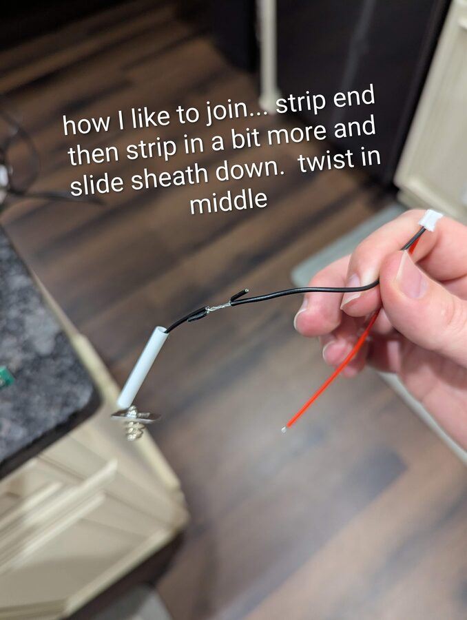

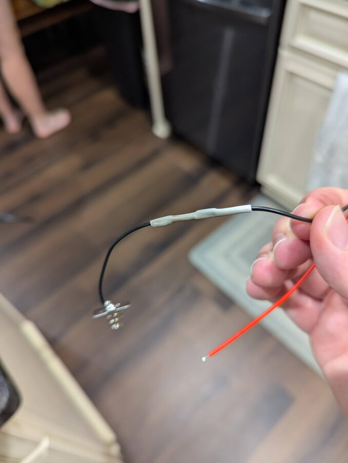

---

### Step 7 - Re-solder the switch board and reassemble battery wiring

Solder two wires back onto the stripped switch board to wire it in-line with the battery circuit. This gives you a working slide switch to power the RAK board on and off without opening the enclosure.

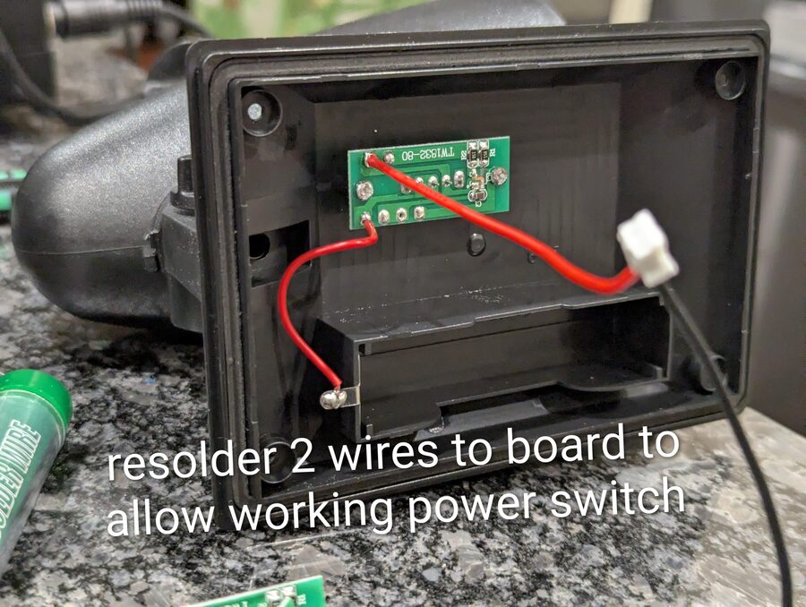

---

### Step 8 - Drill the SMA hole and route the antenna pigtail

Lay the light so the base circle sits flat on the table - the head will be at an angle. Drill at the very top of the head so that when the unit hangs, the SMA connector sits at the highest point and the antenna points straight up. The 20cm SMA pigtail threads through the hole nicely.

!!! warning "Connector orientation"
    Before tightening the SMA nut, make sure the pigtail connector inside is oriented so it can reach the RAK board. It's much harder to fix after the fact.

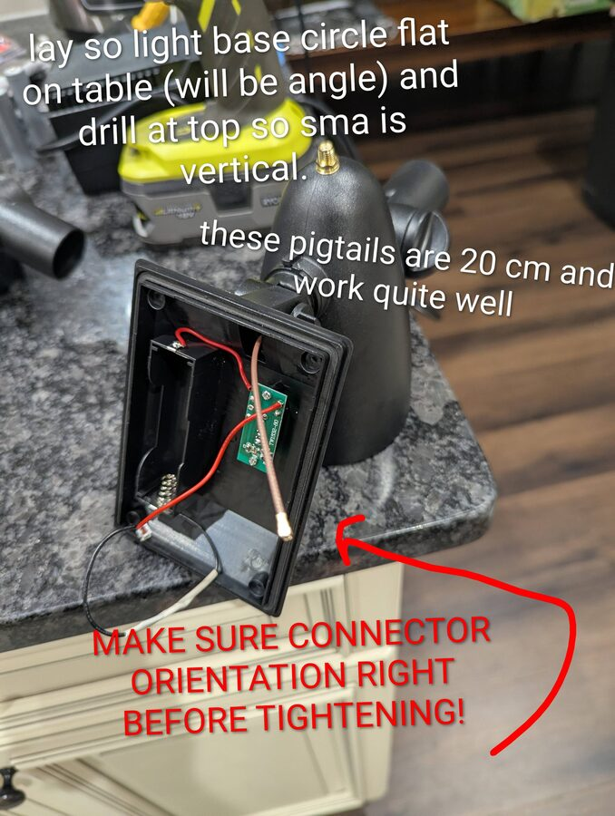

---

### Step 9 - Install the RAK board and connect everything

Drop the RAK board into the battery compartment. Connect the ZH 1.5mm solar pigtail, PH 2.0mm battery pigtail, and SMA pigtail to the board. The wires naturally act as standoffs to keep the board off the plastic - no need for additional hardware, but be tidy. Double-check polarity before closing up.

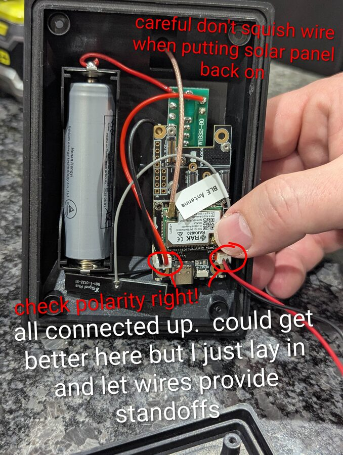

---

### Step 10 - Seal the SMA connector

Apply black marine RTV around the SMA connector where it exits the head to weatherproof the joint. Also fill the small weep hole on the underside of the head - it's there for the original light but will let moisture in if left open.

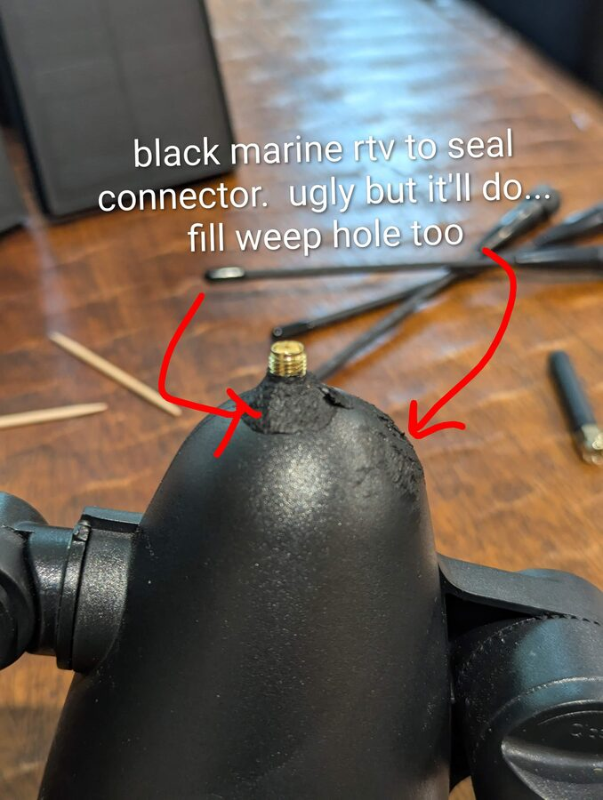

---

### Step 11 - Adjust the tilt joint for vertical antenna

The light's tilt joint lets you rotate the head. When hanging from a tree, you want the antenna pointing perfectly straight up. If the joint's rotation nub prevents you from getting to the right angle, you can cut it off - it has no structural purpose.

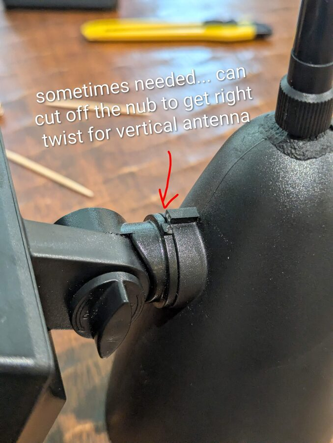

---

### Step 12 - Hang with paracord and set final orientation

Tie 4mm paracord (camo blends in well) through the fixture's mounting bracket. Fold the solar panel arm down toward the head - this keeps the profile compact in the tree and reduces wind load. Adjust the solar panel angle so the antenna hangs perfectly vertical and the panel faces skyward.

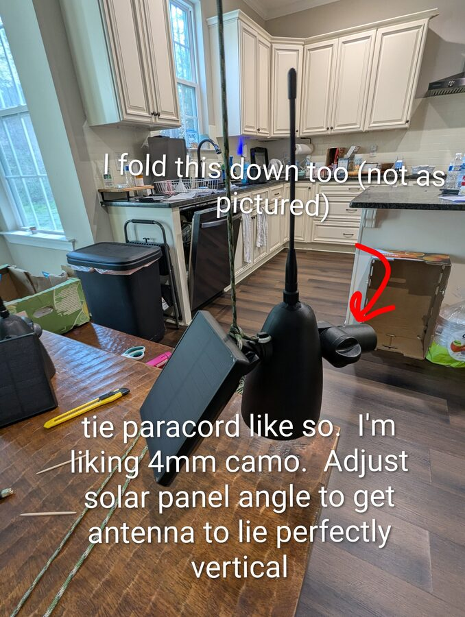

---

### Finished

Three completed nodes ready to deploy. Flash MeshCore firmware using the [Getting Started guide](getting-started.md#step-2-flash-meshcore-firmware), configure each as a repeater in the app settings, and hang them high.

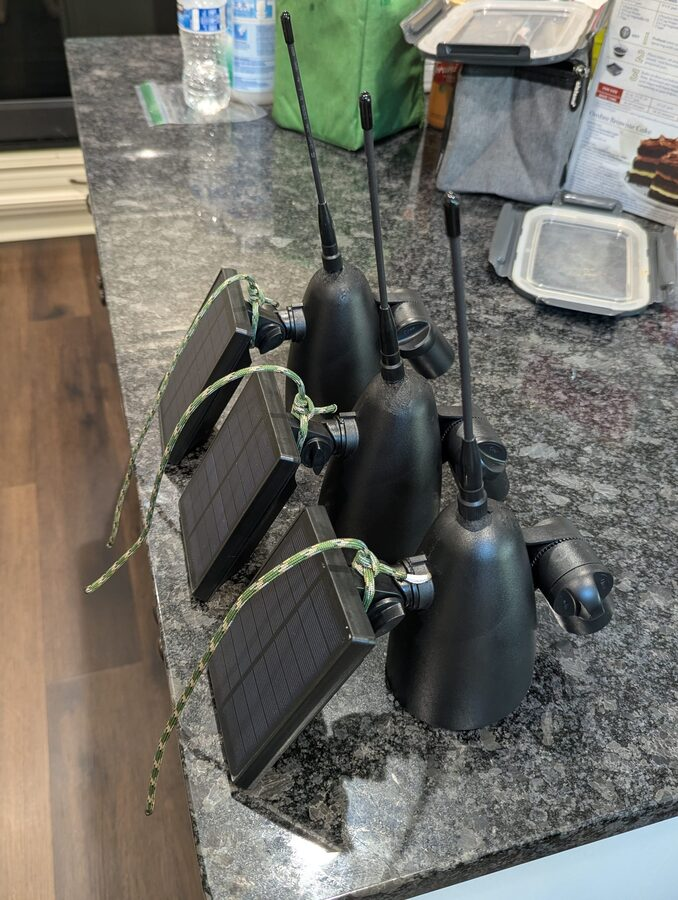

---

## Flash and Configure

1. Before sealing and hanging, connect the RAK board to your computer via USB and flash MeshCore firmware - see the [Getting Started guide](getting-started.md#step-2-flash-meshcore-firmware).
2. In the MeshCore app, pair to the node and go to **Device Settings → Role → Repeater**.
3. Apply the **USA/Canada (Recommended)** radio preset.
4. Hang it at least 15–20 feet up with a clear sky view for the solar panel and minimal obstructions around the antenna.

!!! tip "Higher is better"
    Getting above the canopy makes a dramatic difference in wooded areas. See [Getting More Range: Go Higher](network.md#getting-more-range-go-higher) for placement tips.
