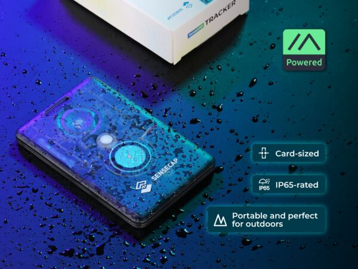
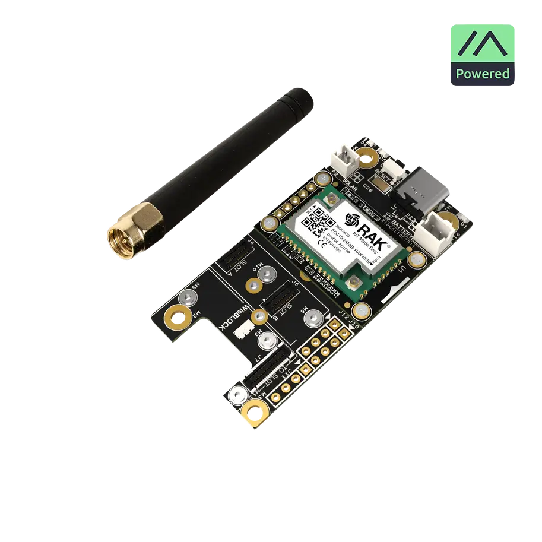
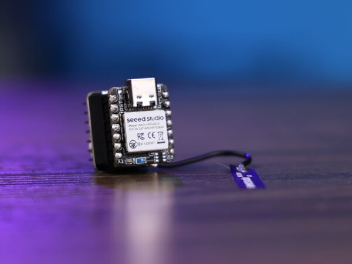
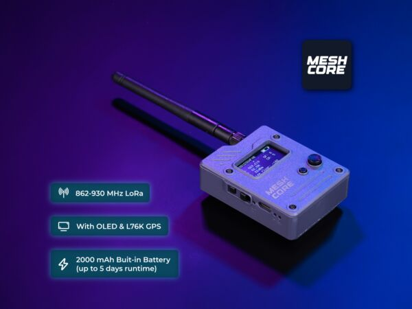
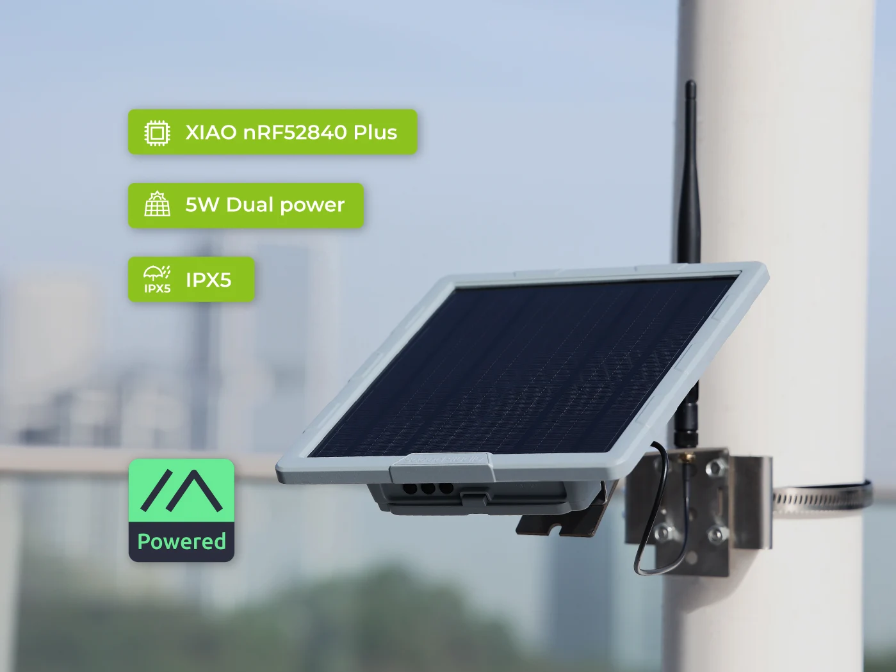
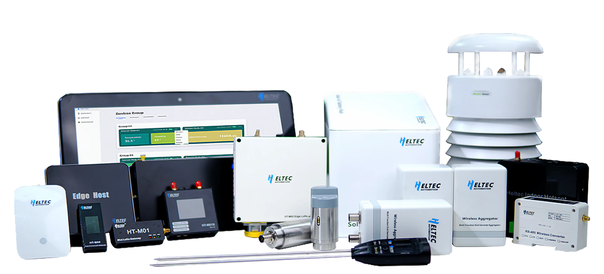
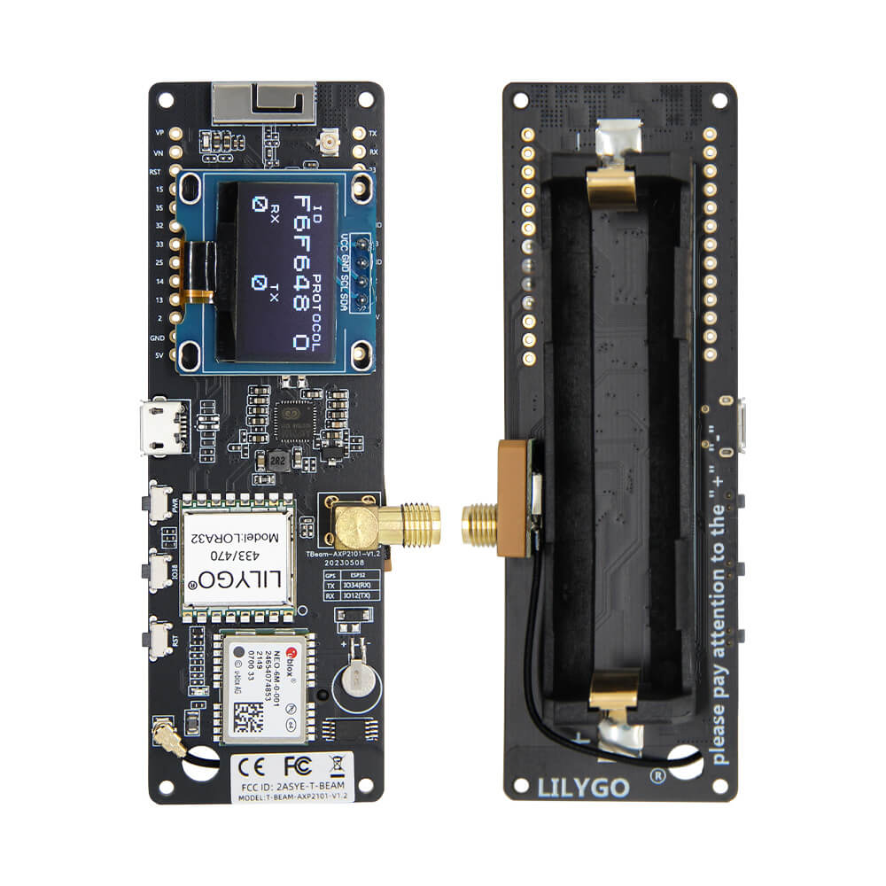
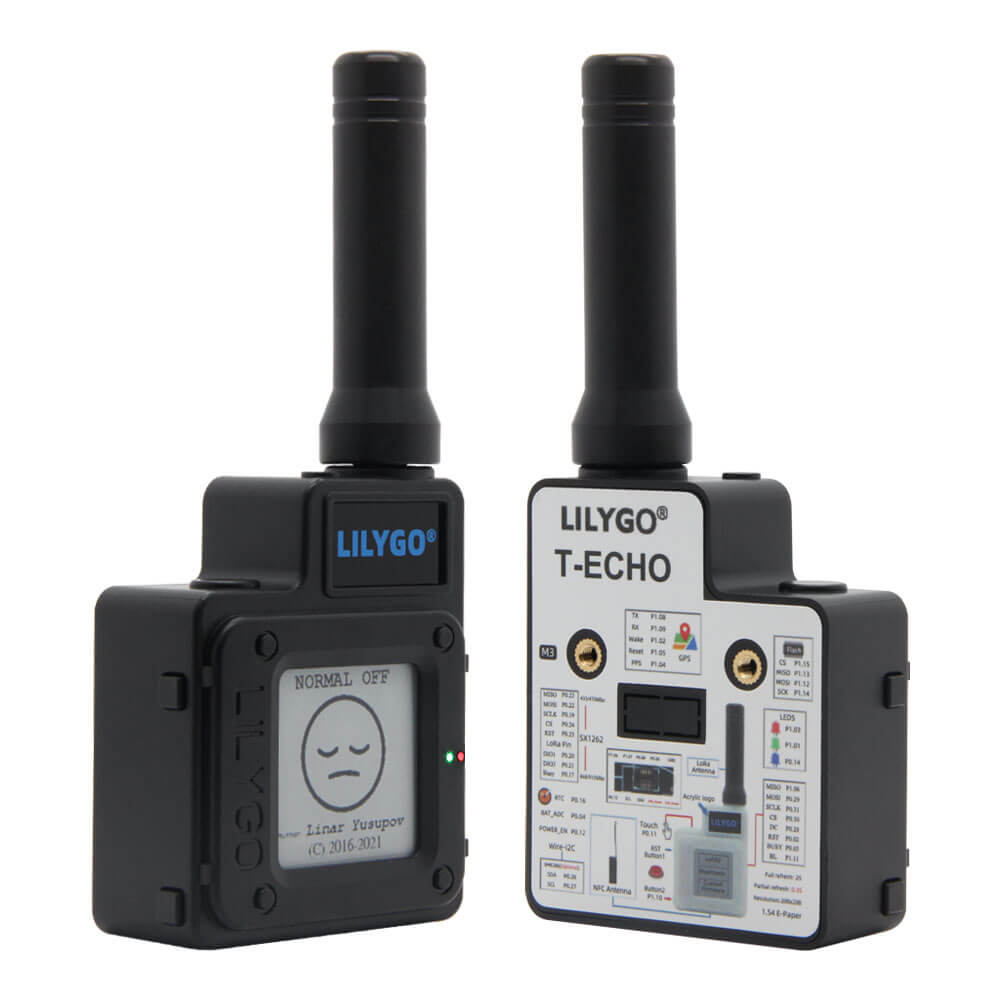

# Hardware Guide

MeshCore runs on a variety of affordable LoRa-based devices. This page covers the most popular options available in 2026, with notes on what works best for different use cases in the CSRA.

!!! warning "USA Band Requirement"
    You **must** purchase a device with the **915 MHz** LoRa band for legal US operation. Double-check product listings — many otherwise identical devices are sold in 868 MHz (EU) variants that cannot be used in the USA.

!!! info "Affiliate links"
    Amazon links on this page use our affiliate tag. **You pay the same price** — commissions go directly toward hardware for CSRA community relay nodes. If you're buying anyway, many thanks for using our links!

---

## Recommended Devices

### Seeed SenseCAP Card Tracker T1000-E

**Best for: Everyday carry, GPS tracking**

Credit-card sized and only 6.5mm thick, the T1000-E packs a full LoRa radio, GPS, and sensors into a pocket-sized IP65-rated device. Originally designed for Meshtastic but MeshCore firmware can be flashed onto it.

{ .product-image }

| Spec | Value |
|---|---|
| Chip | nRF52840 |
| LoRa | LR1110, 863–928 MHz |
| GPS | MediaTek AG3335 GNSS |
| Battery | 700 mAh Li-ion |
| Approximate Price | ~$40 |

**Pros:** Ultra compact, waterproof (IP65), GPS built-in, long battery life  
**Cons:** Ships with Meshtastic firmware — requires reflashing for MeshCore; no display

**Buy:** [Amazon](https://www.amazon.com/SenseCAP-Card-Tracker-T1000-Meshtastic/dp/B0DJ6KGXKB?tag=csrameshcore-20) · [Seeed Studio](https://www.seeedstudio.com/SenseCAP-Card-Tracker-T1000-E-for-Meshtastic-p-5913.html)

---

### RAK WisBlock Starter Kit

**Best for: Fixed nodes, custom builds**

RAK's modular WisBlock system lets you mix and match radio, base board, sensor, and enclosure modules. Popular for building permanent relay nodes. Available in Basic, Client (with OLED), Tracker (with GPS), and PoE/Ethernet variants.

{ .product-image }

| Spec | Value |
|---|---|
| Chip | nRF52840 |
| LoRa | RAK4631 (SX1262), 915 MHz |
| Modular | Yes — add GPS, sensors, displays |
| Approximate Price | $25–60 depending on configuration |

**Pros:** Modular and expandable, very low power, great for outdoor fixed installations  
**Cons:** Requires some assembly, more complex setup than plug-and-play devices

**Buy:** [Amazon](https://www.amazon.com/RAKwireless-WisBlock-Meshtastic-Starter-RAK19007/dp/B0CHKZJK9C?tag=csrameshcore-20) · [RAKwireless Store](https://store.rakwireless.com/products/wisblock-meshtastic-starter-kit)

---

### Seeed XIAO nRF52840 + Wio-SX1262 Kit

**Best for: DIY builds, experimenting, lowest cost entry point**

A tiny two-board kit combining the XIAO nRF52840 and a Wio-SX1262 LoRa module. Minimal footprint (21×17.8 mm) and extremely low power draw make it ideal for custom enclosures, sensor nodes, or simply getting started for as little as possible.

{ .product-image }

| Spec | Value |
|---|---|
| Chip | nRF52840 |
| LoRa | SX1262, 862–930 MHz |
| Display | None (add your own) |
| Battery | None included |
| Approximate Price | ~$13 |

**Pros:** Extremely affordable, tiny form factor, very low power  
**Cons:** No display, no battery, no enclosure — requires DIY assembly; ships with Meshtastic firmware

**Buy:** [Amazon](https://www.amazon.com/Wio-SX1262-Meshtastic-862-930MHz-Microcontroller-Integrated/dp/B0G2XV2F72?tag=csrameshcore-20) · [Seeed Studio](https://www.seeedstudio.com/XIAO-nRF52840-Wio-SX1262-Kit-for-Meshtastic-p-6400.html)

---

### Seeed Wio Tracker L1 Pro

**Best for: Portable use, out-of-the-box ready**

A fully assembled, rugged node in a 3D-printed enclosure with an OLED display, GPS, and battery included. Ready to deploy without any additional hardware. A MeshCore-preflashed version is available directly from Seeed.

{ .product-image }

| Spec | Value |
|---|---|
| Chip | nRF52840 |
| LoRa | SX1262, 862–930 MHz |
| GPS | L76K GNSS |
| Display | 1.3" OLED (128×64) |
| Approximate Price | ~$47 |

**Pros:** Complete out-of-the-box package, rugged enclosure, display and GPS included  
**Cons:** Standard version ships with Meshtastic firmware — order the MeshCore edition or reflash

**Buy:** [Amazon](https://www.amazon.com/seeed-studio-L1-Pro-Tracker/dp/B0FNCS5ST1?tag=csrameshcore-20) · [Seeed Studio (MeshCore edition)](https://www.seeedstudio.com/Wio-Tracker-L1-Pro-for-Meshcore-p-6717.html)

---

### Seeed SenseCAP Solar Node P1-Pro

**Best for: Permanent fixed relay nodes**

Purpose-built for MeshCore and designed to run indefinitely off solar power. Combines solar charging, GPS, OLED display, and MeshCore repeater firmware out of the box — the only device on this list that ships MeshCore-ready from the factory.

{ .product-image }

| Spec | Value |
|---|---|
| Chip | nRF52840 |
| LoRa | Wio-SX1262, 915 MHz |
| GPS | L76K GNSS |
| Display | OLED |
| Power | Solar with battery backup |
| Approximate Price | ~$90 |

**Pros:** Ships with MeshCore firmware, solar-powered, GPS, designed for permanent outdoor deployment  
**Cons:** Higher cost, overkill for handheld use

**Buy:** [Amazon](https://www.amazon.com/SenseCAP-Solar-Node-P1-Pro-Communication/dp/B0FMDHBWX8?tag=csrameshcore-20) · [Seeed Studio (MeshCore edition)](https://www.seeedstudio.com/SenseCAP-Solar-Node-P1-Pro-for-Meshcore-p-6741.html)

---

### Heltec WiFi LoRa 32 V3

**Best for: Beginners, portable use**

The Heltec V3 is one of the most popular MeshCore devices due to its built-in display, USB-C charging, and low cost. It's a great first device.

{ .product-image }

| Spec | Value |
|---|---|
| Chip | ESP32-S3 |
| LoRa | SX1262, 915 MHz |
| Display | 0.96" OLED |
| Battery | 18650 via JST connector |
| Approximate Price | $25–35 |

**Pros:** Cheap, widely available, integrated display, easy to flash  
**Cons:** Smaller battery connector, no GPS, basic casing

**Buy:** [Amazon](https://www.amazon.com/Heltec-Development-915-MHz-Case/dp/B0DHGZKCL1?tag=csrameshcore-20) · [Heltec](https://heltec.org/project/wifi-lora-32-v3/)

---

### LILYGO T-Beam

**Best for: GPS tracking, mobile use**

The T-Beam includes an onboard GPS module, making it ideal for location sharing and tracking. Available in multiple antenna configurations.

{ .product-image }

| Spec | Value |
|---|---|
| Chip | ESP32 |
| LoRa | SX1276 or SX1262, 915 MHz |
| GPS | u-blox NEO-M8N |
| Display | Optional OLED add-on |
| Approximate Price | $35–55 |

**Pros:** GPS built-in, 18650 battery holder included, robust community support  
**Cons:** Larger form factor, older SX1276 on some versions (confirm SX1262 for best performance)

**Buy:** [Amazon](https://www.amazon.com/LILYGO-Meshtastic-Development-CH9102F-Soldered/dp/B0B63FV7FR?tag=csrameshcore-20) · [LILYGO](https://lilygo.cc/products/t-beam)

---

### LILYGO T-Echo

**Best for: Everyday carry, e-ink display**

The T-Echo is a compact, finished-looking device with an e-ink display that's readable in direct sunlight — great for outdoor use.

{ .product-image }

| Spec | Value |
|---|---|
| Chip | nRF52840 |
| LoRa | SX1262, 915 MHz |
| Display | 1.54" e-ink |
| GPS | Optional |
| Approximate Price | $45–65 |

**Pros:** Excellent battery life (nRF52840 is very low power), sunlight readable, compact  
**Cons:** nRF52840 flash process is slightly different — use the [nRF-specific flasher instructions](https://meshcore.io/docs)

**Buy:** [Amazon](https://www.amazon.com/LILYGO-Wireless-Development-NRF52840-Arduino/dp/B0DDT6Z3N9?tag=csrameshcore-20) · [LILYGO](https://lilygo.cc/products/t-echo-lilygo)

---

## Antennas

The stock antenna that comes with most devices is adequate for getting started, but upgrading your antenna can dramatically improve range.

| Antenna Type | Use Case | Gain |
|---|---|---|
| Stock stub antenna | Handheld / portable | 0–2 dBi |
| Fiberglass whip (12–18") | Fixed node, elevated | 3–5 dBi |
| Yagi directional | Point-to-point links | 8–12 dBi |

!!! tip "Height beats power"
    A $15 antenna on a rooftop will outperform a $100 antenna at ground level. For fixed relay nodes in the CSRA, elevation is the most valuable upgrade.

---

## Enclosures for Fixed Nodes

If you're deploying a permanent relay node outdoors, weatherproofing is essential in the humid Augusta climate.

- **Hammond 1554 series** (IP67) — watertight, easy to modify, widely available
- **BUD Industries NBF series** — good balance of size and price
- **3D printed + conformal coat** — flexible but requires proper sealing around connectors

Use **N-type** or **SMA** weatherproof connectors for antenna feed-throughs. Don't leave coax connectors exposed to rain.

---

## Power Options for Fixed Nodes

| Option | Notes |
|---|---|
| USB wall adapter | Simplest, requires AC power at site |
| USB power bank | Good for short-term / portable deployments |
| 18650 + solar panel | Popular for off-grid relay nodes |
| LiFePO4 battery + MPPT | Best long-term solution for outdoor solar nodes |

A 5W solar panel with a 3000 mAh LiFePO4 battery is sufficient to power most devices indefinitely in the CSRA's sun exposure.

---

## Where to Buy

- **Amazon** — fastest shipping, verify seller ratings and confirm 915 MHz
- **AliExpress** — lowest prices, 2–4 week shipping from China, check band carefully
- **Rokland** (rokland.com) — US-based, LoRa specialty retailer, good antenna selection
- **Mouser / Digi-Key** — for RAK WisBlock modules and professional components

---

## What NOT to Buy

- **433 MHz devices** — wrong frequency band for the USA, illegal on unlicensed frequencies
- **868 MHz devices** — EU band, will not interoperate with the CSRA network
- **No-name "LoRa" modules without SX1276/SX1262** — clone chips often have poor range and reliability
